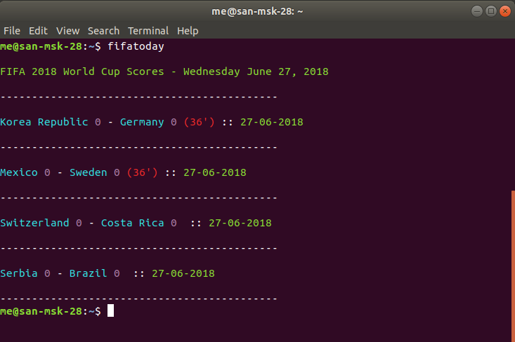

# FIFA 2018 World Cup Scores CLI

<p>Get FIFA 2018 World Cup Scores ⚽</p>

> Code Inspired from https://github.com/johnbfox/world-cup-scores-cli (I clone and Modified this for Learning Purpose)

<p align=center>

</p>

## Installing

```sh
npm install -g fifa-wcscores
```

## Running

```sh
fifatoday
```

```sh
FIFA 2018 World Cup Scores - Wednesday June 27, 2018

--------------------------------------------

Korea Republic 0 - Germany 0 (35') :: 27-06-2018

--------------------------------------------

Mexico 0 - Sweden 0 (34') :: 27-06-2018

--------------------------------------------

Switzerland 0 - Costa Rica 0  :: 27-06-2018

--------------------------------------------

Serbia 0 - Brazil 0  :: 27-06-2018

--------------------------------------------
```

**Credits to estiens for the killer api
https://github.com/estiens/world_cup_json**
